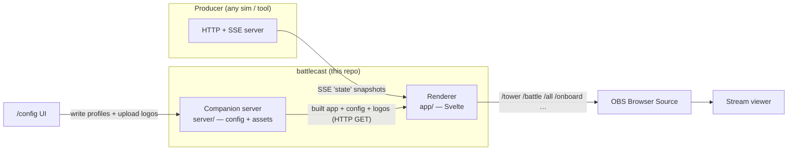
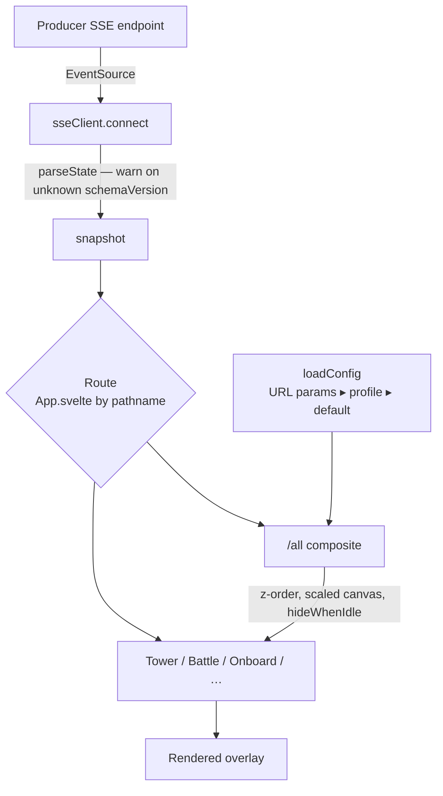

# Architecture

This document orients human developers to how battlecast is put together. For the machine-facing
specification (behavioral rules and code-navigation detail), see `.ai/spec/`.

## What battlecast is

battlecast turns a live race-state feed into broadcast graphics. It is a **renderer**, nothing more:
it draws overlays and never contains race logic. A **producer** — any tool, for any sim — runs an
HTTP + Server-Sent-Events server that streams complete snapshots of race state, and battlecast
connects *out* to it as a client and renders the standings tower, battle box, lower-thirds, session
status, and on-board HUD. The graphics are loaded into OBS as transparent Browser Sources.

The single most important fact: **battlecast is the client, the producer is the server.** battlecast
never receives pushes on a port it owns; it opens an `EventSource` to a producer-hosted endpoint.

## System boundaries

The producer contract is the only coupling to the outside world. It is defined in `spec/v1/`
(`SPEC.md` prose + `schema.json` source-of-truth), and any producer that implements it can drive
battlecast. A compliance harness (`spec/v1/compliance/`) lets producer authors self-check.

## Render data flow

Each `state` event is a **complete snapshot** (not a delta), so a widget can render purely from the
most recent event.

Routing is by URL pathname (OBS launches each widget by URL), not an in-app router — see
`app/src/App.svelte`.

## The two contracts

battlecast has two independent, separately-versioned contracts:

1. **The protocol** (`spec/v1`, `schemaVersion`) — how a producer describes race state. Grows by
   optional, additive fields (`additionalProperties: true` everywhere); `schemaVersion` bumps only
   on a breaking change.
2. **The overlay config** (`app/src/lib/overlayConfig.js`, `configVersion`) — layout, visibility,
   logo rotation, and motion. Read by render pages, written only by the `/config` UI.

Keeping them separate means the config UI can evolve without touching the producer contract, and
vice-versa.

## Guiding principles

- **Dumb overlay, smart producer.** Any derived or semantic fact (class-best lap, target time, gap
  to leader, battle intensity) is computed by the producer and delivered as a field. The overlay
  reads the field and never re-derives it by scanning the field of cars. This mirrors how
  `battle_intensity` has always been an opaque producer computation, and it keeps battlecast sim-
  and producer-agnostic.
- **Split read from write.** Render pages only ever *read* config over HTTP; the `/config` UI is the
  only writer. Because the render path is pure HTTP GET, the same pages work unchanged against the
  companion server or a plain static host with committed `config/` + `logos/` folders — static
  degradation is designed in, not a separate code path (see `docs/decisions/0001-…`).
- **Animate by default.** OBS's Browser Source (Chromium/CEF) reports
  `prefers-reduced-motion: reduce`, but the OBS machine is not the audience. Motion is resolved once
  into a `<html data-motion>` attribute that both CSS and JS read; the OS media query is ignored.
  Reduced motion is an explicit opt-in (`?motion=reduced` or the `/config` toggle).
- **Fixture-based behavioral testing.** Tests drive widgets with real `spec/v1` fixtures and assert
  on rendered content, never on "it mounted." The same fixtures validate against `schema.json`,
  replay from the mock producer, and drive unit tests, so a contract change surfaces everywhere.

## Repository layout

| Path | What it is |
|---|---|
| `app/` | The renderer — Vite + Svelte 5. Overlay pages, `/config` editor, design system, tests. |
| `spec/v1/` | The producer↔battlecast protocol: `SPEC.md`, `schema.json`, fixtures, compliance harness. |
| `producers/mock/` | Reference SSE producer that replays/simulates fixtures — the dev feed. |
| `server/` | Companion config/asset server (`battlecast serve`), zero-dependency Node. |
| `scripts/dev.mjs` | Dev-stack launcher behind `make dev`. |
| `docs/decisions/` | Accepted architecture decision records (ADRs). |
| `.ai/spec/` | Machine-facing specifications (what/ + how/). |

## Where to read next

- Behavioral rules and code navigation: `.ai/spec/README.md`
- The wire contract: `spec/v1/SPEC.md` + `spec/v1/schema.json`
- Key decisions: `docs/decisions/0001-overlay-config-and-asset-persistence.md`,
  `docs/decisions/0002-lower-third-widgets.md`
- Release flow: `RELEASING.md`; testing bar: `CONTRIBUTING.md`
